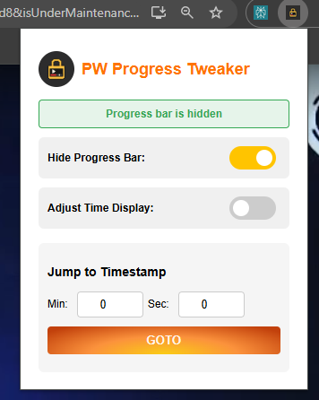

# 🎯 PW Progress Tweaker – Chrome Extension

A powerful Chrome Extension to improve your learning experience on [PW (PhysicsWallah)](https://www.pw.live) lectures:

- ✅ Hide the distracting progress bar.
- ⏩ Navigate to any point in the lecture using minutes + seconds.
- 🕒 View adjusted video duration based on playback speed (2× makes 1 hr look like 30 mins!).

Built for students who want **focus + control** while studying.  
No BS. Just features that matter.

---

## ✨ Features

| Feature                              | Description                                                                 |
|--------------------------------------|-----------------------------------------------------------------------------|
| ✅ Remove Progress Bar               | Toggle to hide the video progress bar completely.                          |
| ⏱ Go To Time                         | Enter `minutes` and `seconds`, click `GOTO`, and jump to that exact point. |
| ⚡ Adjust for Playback Speed         | Toggle to view time left in "real time" based on speed (e.g. 2× halves it).|

---

## 📥 Installation Guide

Here’s how you can install and start using the extension in under 2 minutes:

### 🔧 Step-by-step Setup

1. **Download the Extension Files**

   - Clone the repo using Git:
     ```bash
     git clone https://github.com/AnubhavSC/PW-progress-tweak.git
     ```
   - Or download the [ZIP file](https://github.com/AnubhavSC/PW-progress-tweak/archive/refs/heads/main.zip) and extract it.

2. **Open Chrome and Load the Extension**

   - Go to Chrome and open `chrome://extensions/`.
   - Turn on **Developer Mode** using the toggle in the top-right corner.
   - Click on **Load Unpacked**.
   - Select the folder where you downloaded or extracted the extension.

3. **Done!**  
   You should now see the PW Enhancer icon in your Chrome toolbar.

---

## 🧠 How to Use

1. Open any **PW lecture** in Chrome.
2. Click the extension icon from the toolbar.
3. Use the following controls in the popup:

### ✅ `Remove Progress Bar` Toggle

- When ON, the progress bar below the video disappears.
- Keeps you focused — no temptation to skip ahead!

### ⏱ Jump to Specific Time

- Enter minutes and seconds in the fields.
- Click **`GOTO`** — you’ll be taken to that exact timestamp.

### ⏲ Adjust Time Display by Playback Speed

- When enabled, it calculates the *actual* time left depending on the current speed.
- Example: A 1-hour video at 2× speed = 30 minutes shown.

---

## 📸 Screenshots

- 

---

## 💻 For Developers

- Built using plain JavaScript, HTML, and CSS.
- Interacts with the DOM of PW’s video player.
- Uses `video.currentTime` and `video.playbackRate` for full control.
- No third-party dependencies, no tracking.

---

## 📄 License

MIT License
